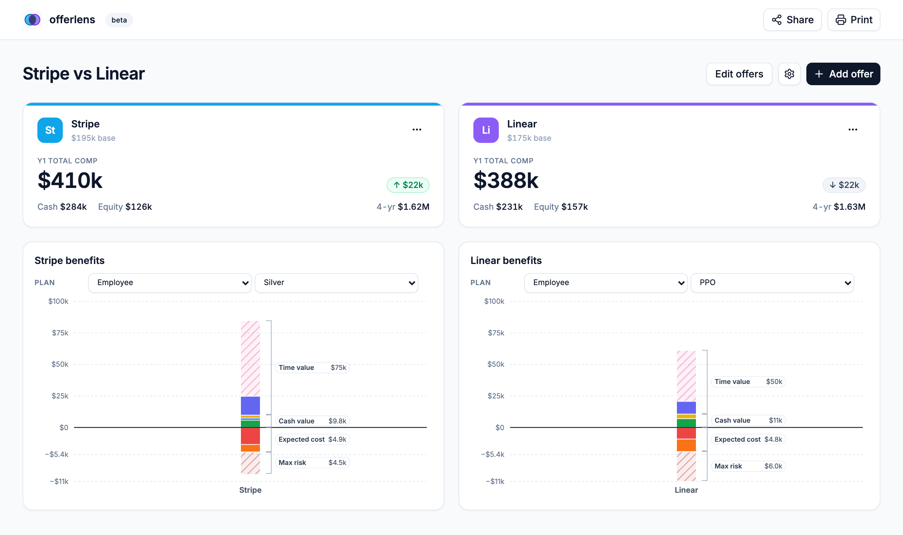

# OfferLens

OfferLens is a browser-only job-offer comparison tool for the parts of compensation that are easy to hand-wave and hard to compare: benefits, 401(k) match, paid leave, PTO, stipends, and worst-case medical cost.

No backend. No accounts. Offers live in your browser, and share links encode the current comparison into the URL.



## Why

Base salary is easy to compare. The rest gets fuzzy fast.

OfferLens gives you a side-by-side view of direct compensation, equity vesting, health-plan costs, employer benefits, and a few “quality of life” values so you can reason through offers without building another spreadsheet from scratch.

## Run locally

```bash
npm install
npm run dev
```

Open <http://localhost:5173>.

## Privacy

- Offer data is stored in your browser's `localStorage`.
- There is no backend database and no account system.
- There is no analytics code in this repo.
- Share links encode the full offer state into the URL hash (`#s=...`). The hash is plaintext base64 JSON. Anyone with the link can read the compensation details, so treat a share URL like a screenshot of your offer letter.
- The app currently loads fonts from Google Fonts. If you want a fully self-contained build, self-host the fonts.

## How It Works

- `src/lib/projection.ts` contains direct compensation and equity projection math.
- `src/lib/benefits.ts` contains benefit-plan selection, premiums, benefit gain/cost segments, and totals used by charts.
- `src/lib/storage.ts` saves and loads the current state from `localStorage`.
- `src/lib/share.ts` encodes and decodes URL share links.

For more project context, see [docs/requirements.md](docs/requirements.md) and
[docs/architecture.md](docs/architecture.md).

## Scripts

- `npm run dev` — start the Vite dev server
- `npm run build` — type-check and build for production
- `npm run lint` — ESLint
- `npm test` — Vitest

## Simplifications

This is a comparison tool, not a payroll model.

- Projections use simple, explainable formulas.
- Equity is modeled with four-year vesting.
- Parental leave and PTO are shown as salary-equivalent values.
- Worst-case medical cost is shown as annual premiums + deductible + remaining OOP risk after deductible.
- Schema version bumps currently reset saved local data instead of migrating it.

## Stack

Vite, React 19, TypeScript, Tailwind v4, shadcn/ui, Recharts, Vitest.

## Maintainer Docs

- [Requirements](docs/requirements.md)
- [Architecture](docs/architecture.md)
- [Release notes](docs/release.md)

## License

[MIT](LICENSE).
